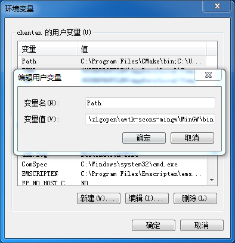

# awtk-scons-mingw
build awtk with scons and mingw  on windows

* 将 awtk 和本项目取到同一级目录

  ```
  cd c:\zlgopen
  git clone https://github.com/zlgopen/awtk.git
  git clone https://github.com/zlgopen/awtk-scons-mingw.git
  ```

* 安装 scons，并设置好 MinGW 的 Path 环境变量

  ```
  C:\zlgopen\awtk-scons-mingw\MinGW\bin
  ```

  

* 修改 awtk 的编译配置 awtk_config.py，使用 mingw 作为编译工具

  ```
  NATIVE_WINDOW='sdl'
  TOOLS_NAME = ''
  TOOLS_NAME = 'mingw'  # 把该行前面的注释去掉
  ```

* 进入目录 awtk，执行 scons 编译

  ```
  cd awtk
  scons
  ```

* 编译其他的 Demo

  ```
  cd c:\zlgopen
  git clone https://github.com/zlgopen/awtk-examples.git
  cd awtk-examples\Chart-Demo
  scons
  ```

